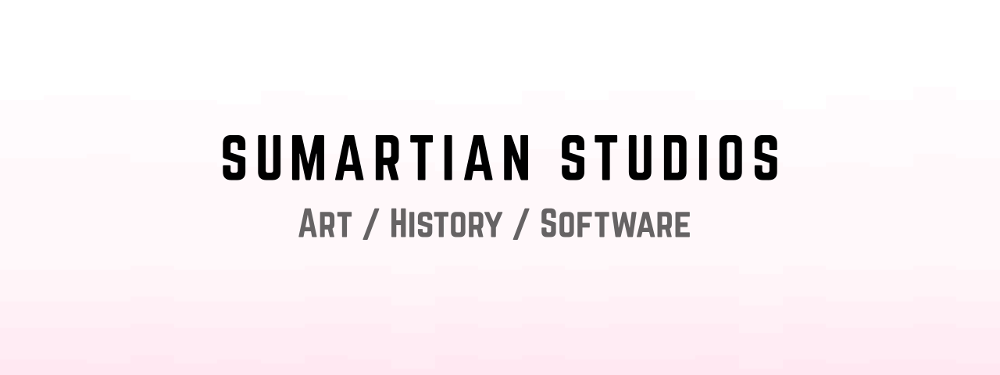

<p></p>

This is the Github Pages website for [Sumartian Studios](https://sumartian.github.io): an organization dedicated to crafting high-quality products at the intersection of art, history, and software.

This website is built using the Hugo static site generator.

## Getting Started

To start the development server:

```
git clone https://github.com/sumartian/sumartian.github.io
cd sumartian.github.io
hugo serve
```

## Contributions

Feel free to submit your contributions.

## Credits

Thank you to the following third-party resources:

- [RemixIcon (Apache v2.0)](https://github.com/Remix-Design/RemixIcon)
- [Roboto (Apache v2.0)](https://github.com/googlefonts/roboto)

## License

The written content is licensed under [Creative Commons Attribution-ShareAlike 4.0 International](./LICENSE.CC-BY-SA). The source code for the website is licensed under [GNU GPL v3.0](./LICENSE.GPLv3). See above for third party licenses.
