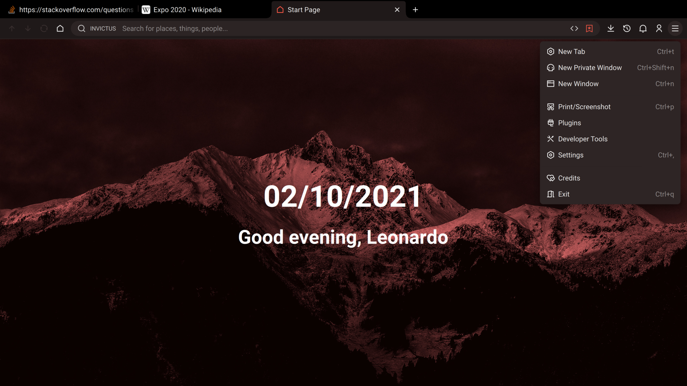
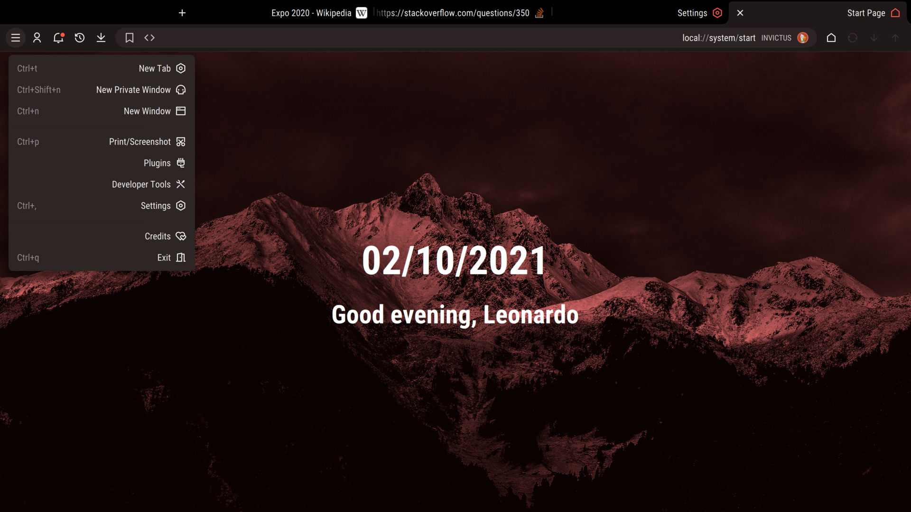
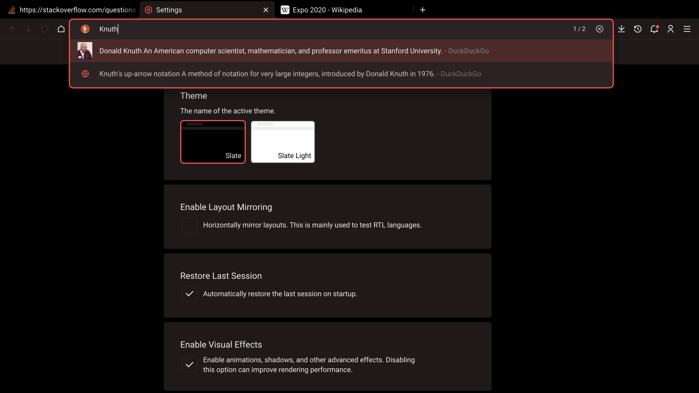
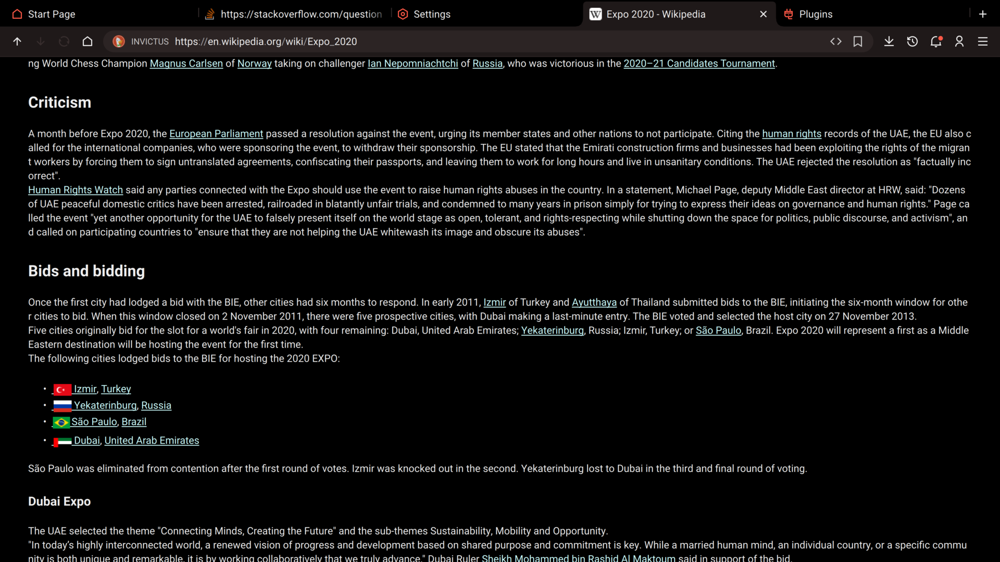
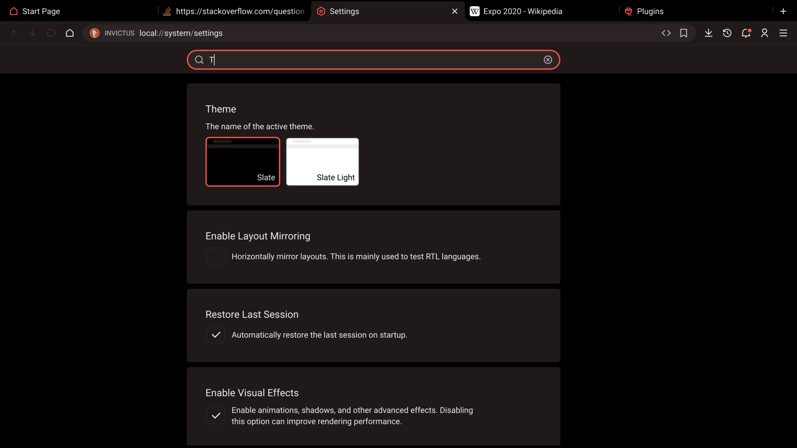
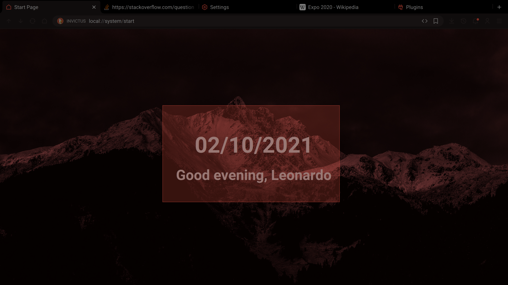
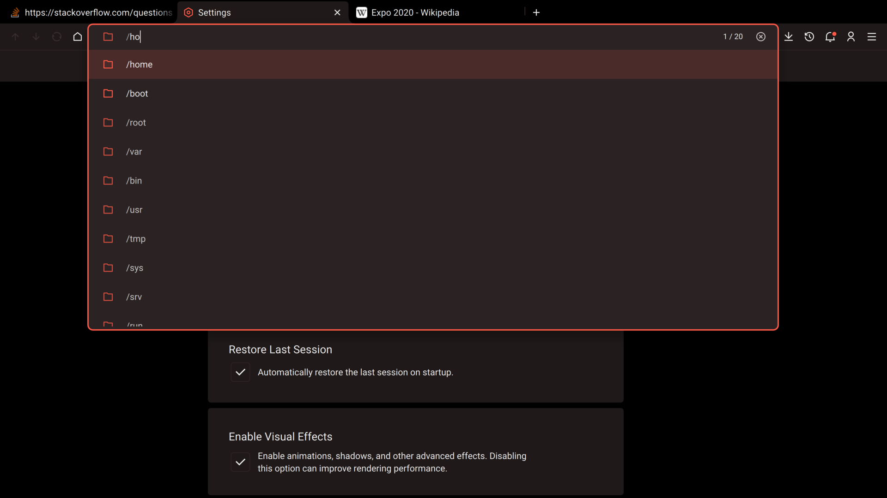
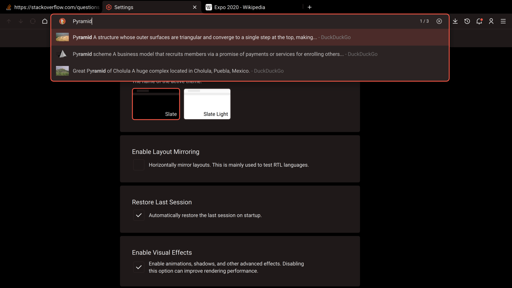

I am working on a new "intergalactic" data browser written in C++23, QML, and Qt6. The goal is to design a software system that can be used by an AI to provide interactive user messages to users. For example, imagine you're on a spaceship and you ask a tablet mounted on the wall to show you where the alien that broke into your ship is currently located. The AI will then render an interactive map of the corridors, show exit strategies, etc... Just like a science fiction movie.

## Why would anyone use this browser?

It looks nice and it has some [interesting features](#what-are-the-interesting-features). Here are some very low-quality screenshots (note that everything is subject to change in the pre-alpha release):

## What are the space features?

- The interface can easily be adapted to new paradigms (i.e. not limited to desktop metaphors)
  - Terminal interface is a possibility (not implemented yet)
  - Voice control is a possibility (not implemented yet)
- There is going to be a separate server application
  - The server application can run simple physics and logistics simulations
  - The browser can visualize the simulations in 3D or 2D
- Maybe support CCSDS protocols

## What are the interesting features?

- Bookmarks optionally disappear after they are visited
- Both GPU or software rendering is supported (to varying levels of effectiveness)
- HiDPi support
  - Everything should be fine even after scaling
- Optional animations (when GPU is enabled)
- It is fast and uses relatively few resources
  - Memory usage should be around 50-100 MBs
  - Extensive caching
  - Tabs are offloaded after inactivity
- It looks like Chromium and can optionally render pages using Blink
  - More strict/private because it blocks almost everything (JS, CSS, images, etc...)
- Can support internationalization if people want to contribute translations
  - I am working on ensuring everything works well with RTL languages
  - Unicode is certainly supported
- Should be cross-platform
  - Have only tested on Linux
- On Linux it uses a custom sandbox and an isolated parser process
  - Probably buggy so do not trust it for anything important
  - Seccomp/Landlock
- More useful history navigation
  - Not stack-based; keeps track of every visit not just the latest one
  - Temporary bookmarks that automatically disappear
  - Generate flashcards using spaced-repetition to improve information retention
- Extensible architecture
  - Every viewer or suggester is implemented inside a plugin
  - A plugin can implement multiple viewers (easier categorization)
- Custom query language that should be intuitive
  - You can evaluate math expressions offline
  - Unit conversions
- The code is clean (in my opinion)
  - Few third-party libraries required aside from Qt
